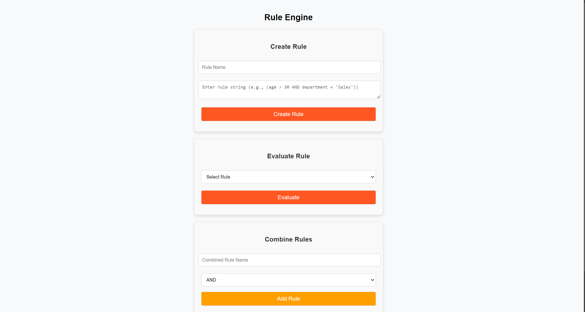
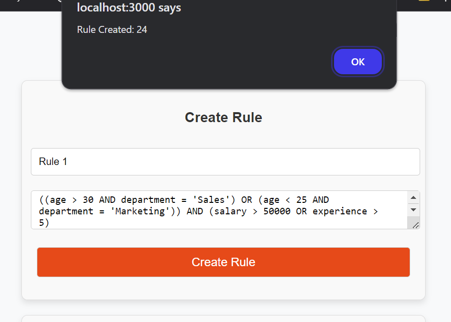
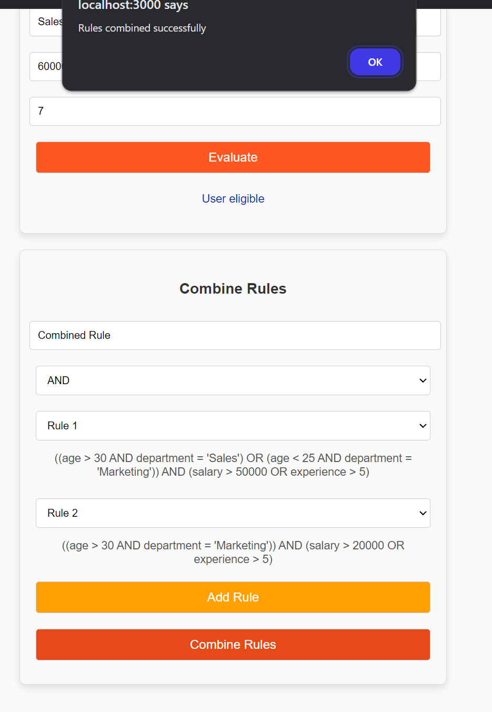
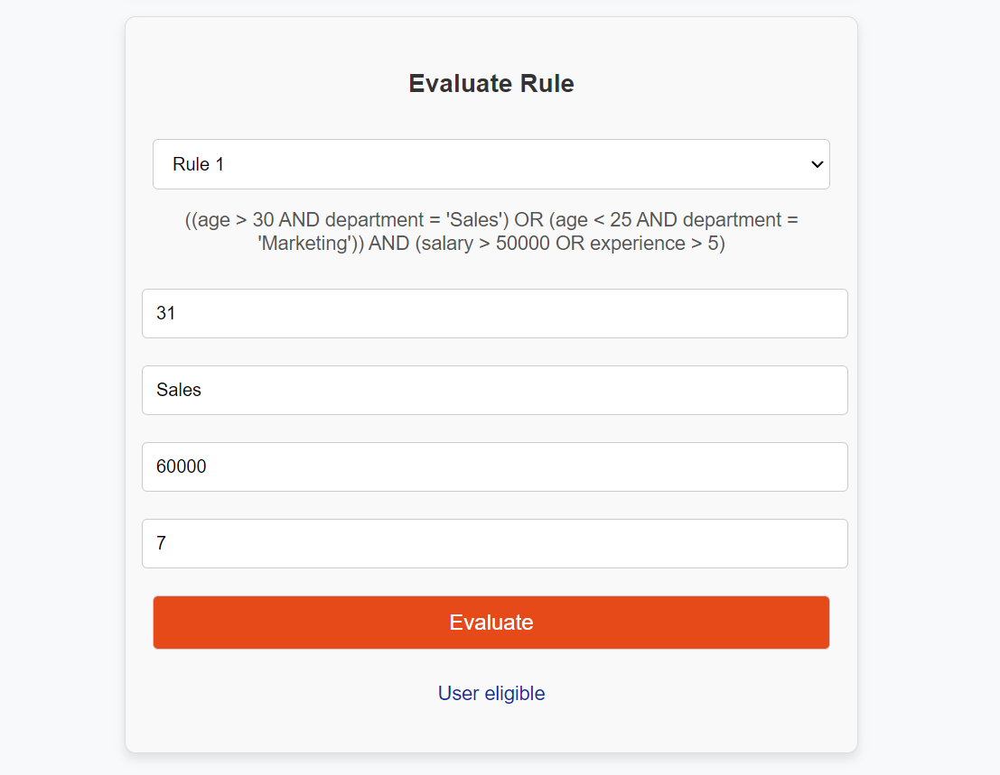
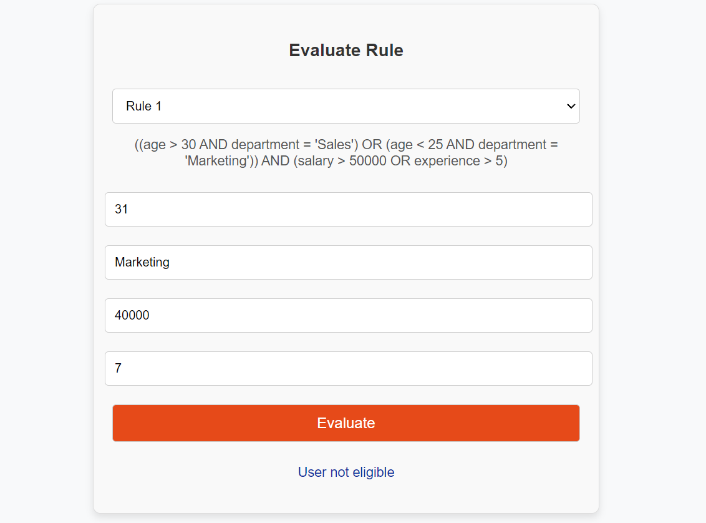

# Rule Engine with AST

A sophisticated rule engine application built with Django, React, and PostgreSQL that uses Abstract Syntax Tree (AST) to determine user eligibility based on various attributes. The system supports dynamic creation, combination, and evaluation of conditional rules.



## Features

- 🌳 AST-based rule representation
- 🔄 Dynamic rule creation and evaluation
- 🤝 Rule combination capabilities
- ✨ Interactive web interface
- 🔍 Rule evaluation with JSON data
- 🛡️ Input validation and error handling
- 📊 PostgreSQL database integration

## System Architecture

### Backend (Django)
- REST API endpoints for rule operations
- AST implementation for rule processing
- PostgreSQL database integration
- Comprehensive error handling

### Frontend (React)
- User-friendly forms for rule operations
- Real-time rule validation
- Responsive design

### Data Structure
```python
class Node:
    type: str  # "operator" for AND/OR, "operand" for conditions
    value: Any  # value for operand nodes
    left: Node  # left child reference
    right: Node  # right child reference for operators
```

## Installation
```
git clone https://github.com/Mayankrai449/RuleEngine.git
```

### Backend Setup
```
cd backend
```

#### Windows
```bash
# Create virtual environment
python -m venv venv
venv\Scripts\activate

# Install dependencies
pip install -r requirements.txt

# Setup environment variables
copy .env.example .env  # Update with your configurations

# Database setup
python manage.py makemigrations
python manage.py migrate

# Run server
python manage.py runserver
```

#### Linux/MacOS
```bash
# Create virtual environment
python3 -m venv venv
source venv/bin/activate

# Install dependencies
pip install -r requirements.txt

# Setup environment variables
cp .env.example .env  # Update with your configurations

# Database setup
python manage.py makemigrations
python manage.py migrate

# Run server
python manage.py runserver
```

### Frontend Setup
```bash
# Install dependencies
cd ../frontend
npm install

# Start development server
npm start
```

## Environment Configuration

### Backend (.env)
```plaintext
# Sample
SECRET_KEY=__your_django_secret__
DEBUG=True
ALLOWED_HOSTS=*
CORS_ALLOWED_ORIGINS=http://localhost:3000
DB_NAME=__your_db_name__
DB_USER=__your_username__
DB_PASSWORD=__your_password__
DB_HOST=localhost
DB_PORT=5432
```

### Frontend Configuration
Check `src/services/api.js` to configure the backend URL:
```javascript
const API_BASE_URL = 'http://localhost:8000';
```

## Usage

The application provides three main functionalities:

### 1. Create Rule
Create individual rules using conditions and operators:




### 2. Combine Rules
Merge multiple rules into a single AST:



### 3. Evaluate Rule

**User Eligible



**User Not Eligible



## API Endpoints

### Create Rule
```
POST /rules/create_rule/
Body: {
    "name": "Rule 1",
    "rule_string": "score > 75 AND certification = 'yes'"
}
```

### Combine Rules
```
POST /rules/combine_rules/
Body: {
    "name": "Combined Rule",
    "operator": "OR",
    "rule_ids": [1, 2, 3]
}
```

### Evaluate Rule
```
POST /rules/evaluate_rule/
Body: {
    "rule_id": 1,
    "data": {
        "age": 35,
        "department": "Sales",
        "salary": 60000,
        "experience": 3
    }
}
```


## Additional Features

- **Error Handling**: Comprehensive validation for rule syntax and data formats
- **Attribute Validation**: Support for predefined attribute catalogs
- **Frontend**: Dynamic React.js Frontend with easy to use UI

## Database Schema

```sql
CREATE TABLE rule (
    id SERIAL PRIMARY KEY,  -- Auto-incrementing primary key
    name VARCHAR(255) NOT NULL DEFAULT 'Unnamed Rule',  -- Rule name with default value
    rule_string TEXT NOT NULL,  -- Rule string
    ast_json JSONB NOT NULL,  -- AST representation in JSON format
    created_at TIMESTAMP WITH TIME ZONE DEFAULT CURRENT_TIMESTAMP,  -- Timestamp for creation
    updated_at TIMESTAMP WITH TIME ZONE DEFAULT CURRENT_TIMESTAMP,  -- Timestamp for last update
    is_active BOOLEAN DEFAULT TRUE,  -- Active status of the rule
    -- Indexes
    INDEX idx_rule_name (name),  -- Index on name
    INDEX idx_rule_created_at (created_at),  -- Index on created_at
    INDEX idx_rule_is_active (is_active)  -- Index on is_active
);
```
